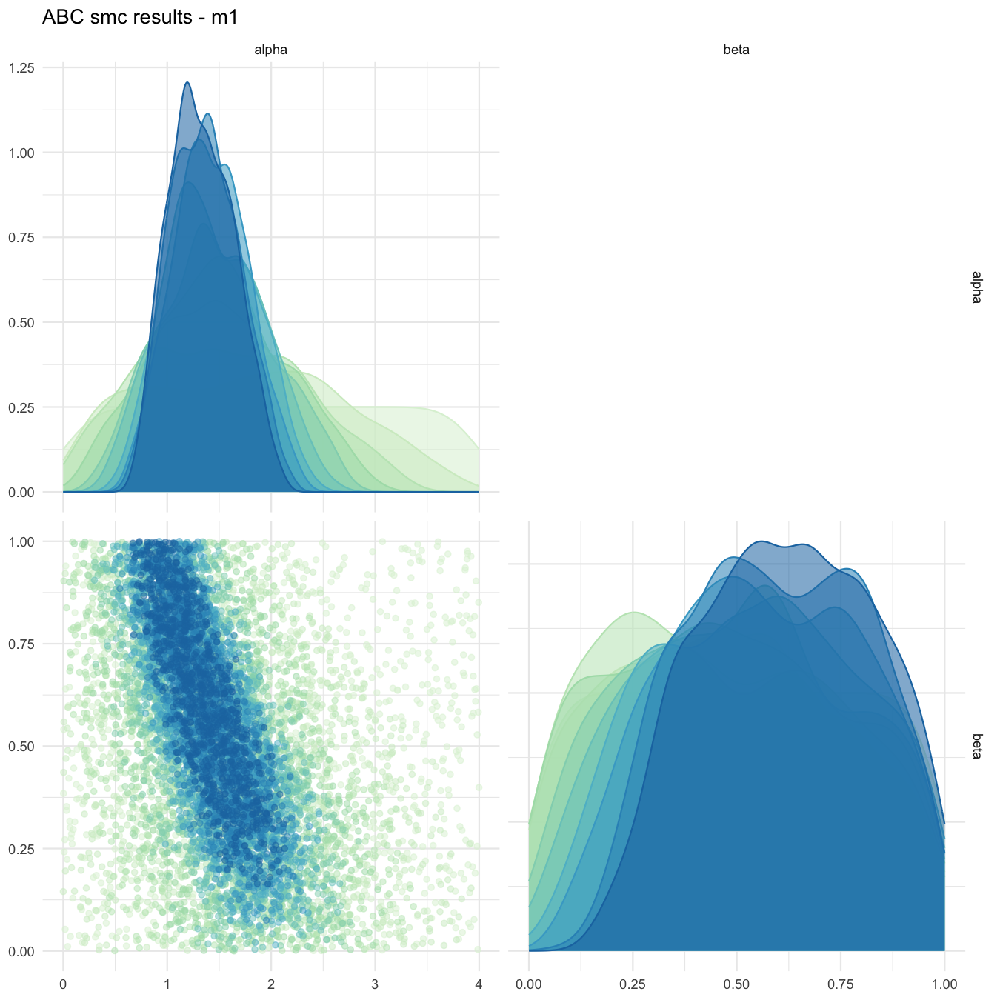
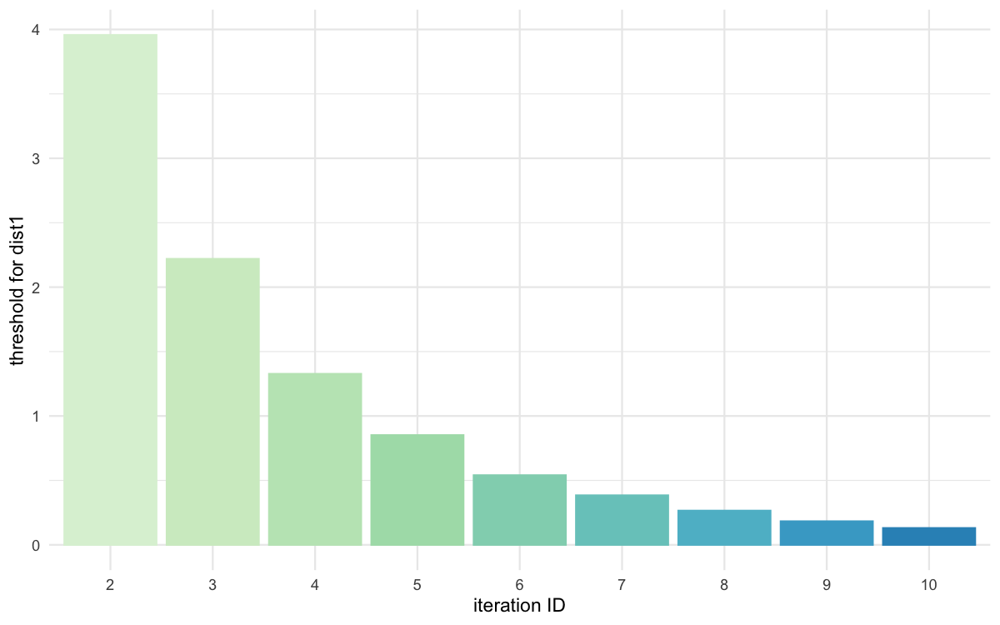
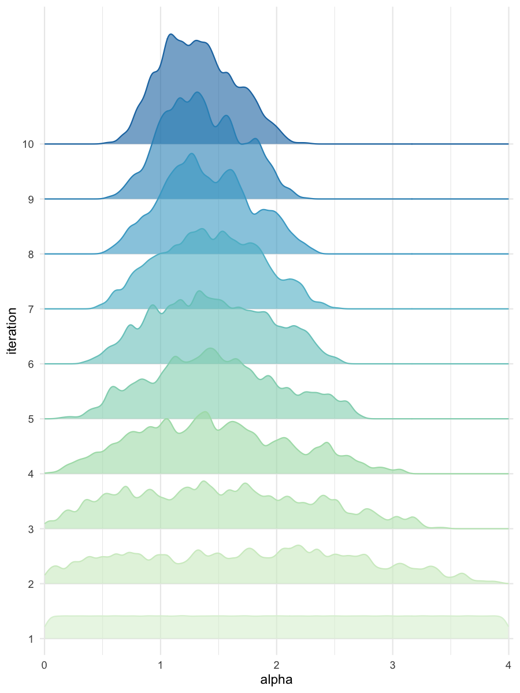
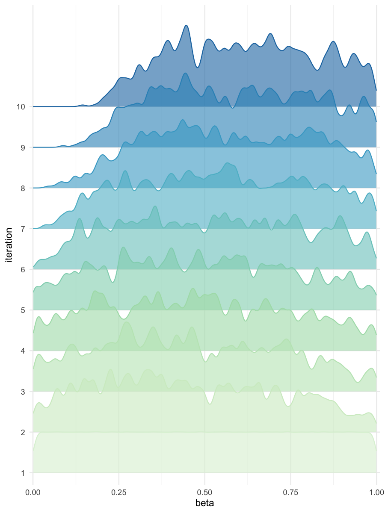

<!-- README.md is generated from README.Rmd. Please edit that file -->

# BRREWABC 

<!-- badges: start -->
<!-- badges: end -->

BRREWABC (Batched Resilient and Rapid Estimation Workflow through
Approximate Bayesian Computation) : an R package designed to facilitate
inference through a parallelized Approximate Bayesian Computation
Sequential Monte Carlo (ABC SMC) algorithm. This package streamlines the
process of conducting Bayesian inference for complex models by
implementing efficient parallelization techniques.

## Installation

You can install the development version of BRREWABC from
[GitHub](https://github.com/) with:

``` r
# install.packages("devtools")
devtools::install_github("GaelBn/BRREWABC")
```

## Usage

This is a basic example which shows you how to solve a common problem:

``` r
library(BRREWABC)

# model definition
compute_dist = function(x, ss_obs){
    ss_sim = c( x[["alpha"]] + x[["beta"]] + rnorm(1,0,0.1),
           x[["alpha"]] * x[["beta"]] + rnorm(1,0,0.1) ) # a very simple toy model
    dist = sum((ss_sim-ss_obs)^2)
    return(c(dist))
}

MODEL_LIST <- list("m1" = compute_dist)
PRIOR_DIST <- list("m1" = list(c('alpha', 'unif', 0, 4), c('beta', 'unif', 0, 1)))

# create a reference trajectory
sum_stat_obs = c(2.0,0.75)

# run abc smc procedure
res = abcsmc(model_list = MODEL_LIST, prior_dist = PRIOR_DIST,
  ss_obs = sum_stat_obs, max_number_of_gen = 10, nb_acc_prtcl_per_gen = 1000,
  new_threshold_quantile = 0.8, experiment_folderpath = "",
  max_concurrent_jobs = 2, verbose = TRUE)
#> [1] "tmp/currentABCState.RData"
#> Check folder_path for : tmp
#> Folder created successfully.
#> Check folder_path for : res
#> Folder created successfully.
#> Check folder_path for : res/csv
#> Folder created successfully.
#> Check folder_path for : res/figs
#> Folder created successfully.
#> gen 1 
#> threshold: 
#> prtrbtn_krnl_sd: NA NA 
#> -
#> gen 2 
#> threshold: 3.737803 
#> prtrbtn_krnl_sd: 1.155267 0.2888316 
#> -
#> gen 3 
#> threshold: 1.983287 
#> prtrbtn_krnl_sd: 0.9096719 0.260107 
#> -
#> gen 4 
#> threshold: 1.24357 
#> prtrbtn_krnl_sd: 0.7365027 0.2600087 
#> -
#> gen 5 
#> threshold: 0.7919258 
#> prtrbtn_krnl_sd: 0.6140646 0.2642821 
#> -
#> gen 6 
#> threshold: 0.5143133 
#> prtrbtn_krnl_sd: 0.5233506 0.2621831 
#> -
#> gen 7 
#> threshold: 0.3568089 
#> prtrbtn_krnl_sd: 0.4602892 0.2574246 
#> -
#> gen 8 
#> threshold: 0.2562583 
#> prtrbtn_krnl_sd: 0.4206442 0.2448884 
#> -
#> gen 9 
#> threshold: 0.1746439 
#> prtrbtn_krnl_sd: 0.3752413 0.2300746 
#> -
#> gen 10 
#> threshold: 0.1286489 
#> prtrbtn_krnl_sd: 0.3576637 0.2233128 
#> -
#> Experiment done!

# get results and plots
all_accepted_particles = res$particles
all_thresholds = res$thresholds
plot_abcsmc_res(data = all_accepted_particles, prior = PRIOR_DIST, colorpal = "GnBu")
#> [1] "Plot saved as '.png'."
#> Registered S3 method overwritten by 'GGally':
#>   method from   
#>   +.gg   ggplot2
plot_densityridges(data = all_accepted_particles, prior = PRIOR_DIST, colorpal = "GnBu")
#> [1] "Plot saved as '.png'."
plot_thresholds(data = all_thresholds, nb_threshold = 1, colorpal = "GnBu")
#> [1] "Plot saved as 'png'."
```

<div class="figure">


<p class="caption">
Pairplot of all iterations
</p>

</div>

<div class="figure">


<p class="caption">
Threshold evolution over iterations
</p>

</div>

<div class="figure">


<p class="caption">
Density estimates for alpha
</p>

</div>

<div class="figure">


<p class="caption">
Density estimates for beta
</p>

</div>
