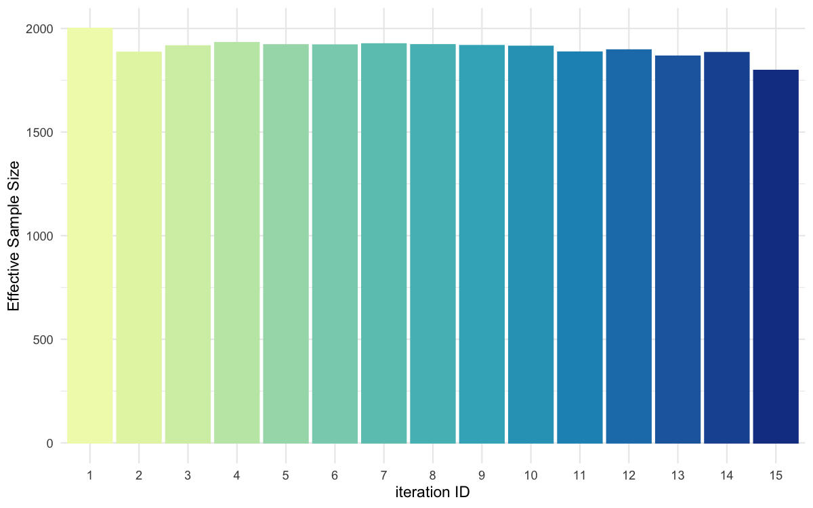

# BRREWABC

## Simple estimation using ABC-SMC

``` r

library(BRREWABC)
```

### Model definition

``` r

compute_dist <- function(x, ss_obs) {
  ss_sim <- c(x[["alpha"]] + x[["beta"]] + rnorm(1, 0, 0.1),
              x[["alpha"]] * x[["beta"]] + rnorm(1, 0, 0.1))
  dist <- sum((ss_sim - ss_obs)^2)
  return(c(dist))
}

model_list <- list("m1" = compute_dist)
```

### Define prior distribution

``` r

prior_dist <- list("m1" = list(c("alpha", "unif", 0, 4),
                               c("beta", "unif", 0, 1)))
```

### Create a reference trajectory

``` r

sum_stat_obs <- c(2.0, 0.75)
```

### Run abc smc procedure

``` r

res <- abcsmc(model_list = model_list,
              prior_dist = prior_dist,
              ss_obs = sum_stat_obs,
              max_number_of_gen = 15,
              nb_acc_prtcl_per_gen = 2000,
              new_threshold_quantile = 0.8,
              experiment_folderpath = "smpl",
              max_concurrent_jobs = 5,
              verbose = FALSE)
```

### Plot results

``` r

all_accepted_particles <- res$particles
all_thresholds <- res$thresholds
plot_abcsmc_res(data = all_accepted_particles, prior = prior_dist,
                filename = "smpl/res/figs/smpl_pairplot_all.png", colorpal = "YlGnBu")
#> [1] "Plot saved as 'png'."
plot_thresholds(data = all_thresholds, nb_threshold = 1,
                filename = "smpl/res/figs/smpl_thresholds.png", colorpal = "YlGnBu")
#> [1] "Plot saved as 'png'."
plot_ess(data = all_accepted_particles,filename = "smpl/res/figs/smpl_ess.png", colorpal = "YlGnBu")
#> [1] "Plot saved as 'png'."
#>    gen      ess
#> 1    1 2000.000
#> 2    2 1879.078
#> 3    3 1917.254
#> 4    4 1919.435
#> 5    5 1917.378
#> 6    6 1931.276
#> 7    7 1927.461
#> 8    8 1927.208
#> 9    9 1902.200
#> 10  10 1902.753
#> 11  11 1896.466
#> 12  12 1888.519
#> 13  13 1877.873
#> 14  14 1851.406
#> 15  15 1833.800
plot_densityridges(data = all_accepted_particles, prior = prior_dist,
                   filename = "smpl/res/figs/smpl_densityridges.png", colorpal = "YlGnBu")
#> [1] "Plot saved as 'png'."
```


Pairplot of all iterations


Threshold evolution over iterations



ESS evolution over iterations


Density estimates for alpha


Density estimates for beta
