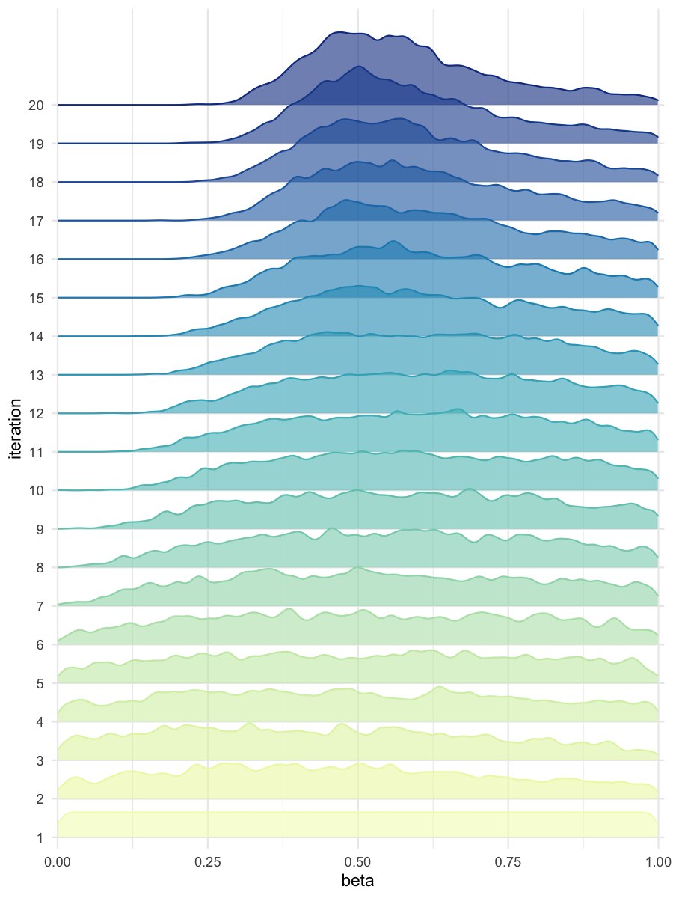

```{r, include = FALSE}
knitr::opts_chunk$set(
  collapse = TRUE,
  comment = "#>"
)
```

```{r setup}
library(BRREWABC)
```

## Model definition
```{r}
compute_dist = function(x, ss_obs){
    ss_sim = c( x[["alpha"]] + x[["beta"]] + rnorm(1,0,0.1),
                x[["alpha"]] * x[["beta"]] + rnorm(1,0,0.1) )
    dist = sum((ss_sim-ss_obs)^2)
    return(c(dist))
}

compute_dist_2 = function(x, ss_obs){
    ss_sim = c( x[["alpha"]] + x[["beta"]] + runif(1,-0.5,0.5),
                x[["alpha"]] * x[["beta"]] + runif(1,-0.5,0.5) )
    dist = sum((ss_sim-ss_obs)^2)
    return(c(dist))
}

compute_dist_3 = function(x, ss_obs){
    ss_sim = c( x[["alpha"]] + x[["gamma"]] + rnorm(1,1,0.1),
                x[["alpha"]] * x[["gamma"]] + rnorm(1,1,0.1) )
    dist = sum((ss_sim-ss_obs)^2)
    return(c(dist))
}

MODEL_LIST <- list("m1" = compute_dist, "m2" = compute_dist_2, "m3" = compute_dist_3)
```

## Define prior distribution
```{r}
PRIOR_DIST <- list("m1" = list(c('alpha', 'unif', 0, 4), c('beta', 'unif', 0, 1)),
                  "m2" = list(c('alpha', 'unif', 0, 4), c('beta', 'unif', 0, 1)),
                  "m3" = list(c('alpha', 'unif', 0, 4), c('gamma', 'unif', 0, 1)))
```

## Create a reference trajectory
```{r}
sum_stat_obs = c(2.0,0.75)
```

## Run abc smc procedure
```{r}
res = abcsmc( model_list = MODEL_LIST,
              prior_dist = PRIOR_DIST,
              ss_obs = sum_stat_obs,
              max_number_of_gen = 20,
              nb_acc_prtcl_per_gen = 2000,
              new_threshold_quantile = 0.8,
              experiment_folderpath = "mdlslctn",
              max_concurrent_jobs = 5,
              verbose = FALSE )
```

## Plot results
```{r}
all_accepted_particles = res$particles
all_thresholds = res$thresholds
plot_abcsmc_res(data = all_accepted_particles, prior = PRIOR_DIST, filename = "mdlslctn_pairplot_all.png", colorpal = "YlGnBu")
plot_densityridges(data = all_accepted_particles, prior = PRIOR_DIST, filename = "mdlslctn_densityridges.png", colorpal = "YlGnBu")
plot_thresholds(data = all_thresholds, nb_threshold = 1, filename = "mdlslctn_thresholds.png", colorpal = "YlGnBu")
```

```{r barplot, echo=FALSE, fig.cap="Selected models over iterations", out.width = '100%'}
knitr::include_graphics("../man/figures/mdlslctn_pairplot_all.png")
```

```{r pairplot, echo=FALSE, fig.cap="Pairplot of all iterations for the predominantly selected model", out.width = '100%'}

```

```{r thresholds, echo=FALSE, fig.cap="Threshold evolution over iterations for the predominantly selected model", out.width = '100%'}
knitr::include_graphics("../man/figures/mdlslctn_thresholds_dist1.png")
```

```{r densityridges_alpha, echo=FALSE, fig.cap="Density estimates of alpha, for the predominantly selected model", out.width = '100%'}

```

```{r densityridges_beta, echo=FALSE, fig.cap="Density estimates of beta, for the predominantly selected model", out.width = '100%'}

```


