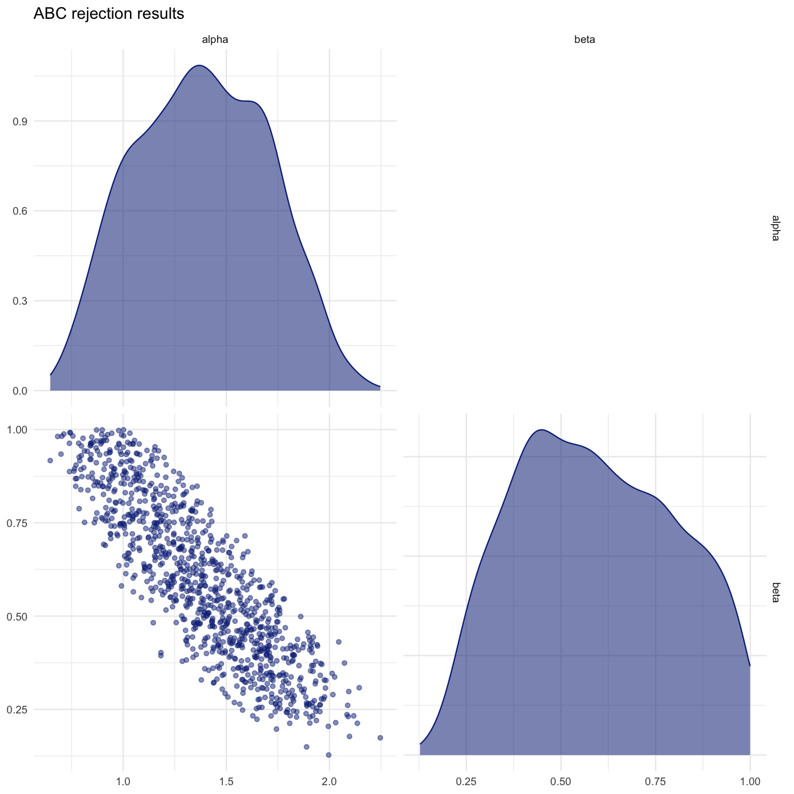
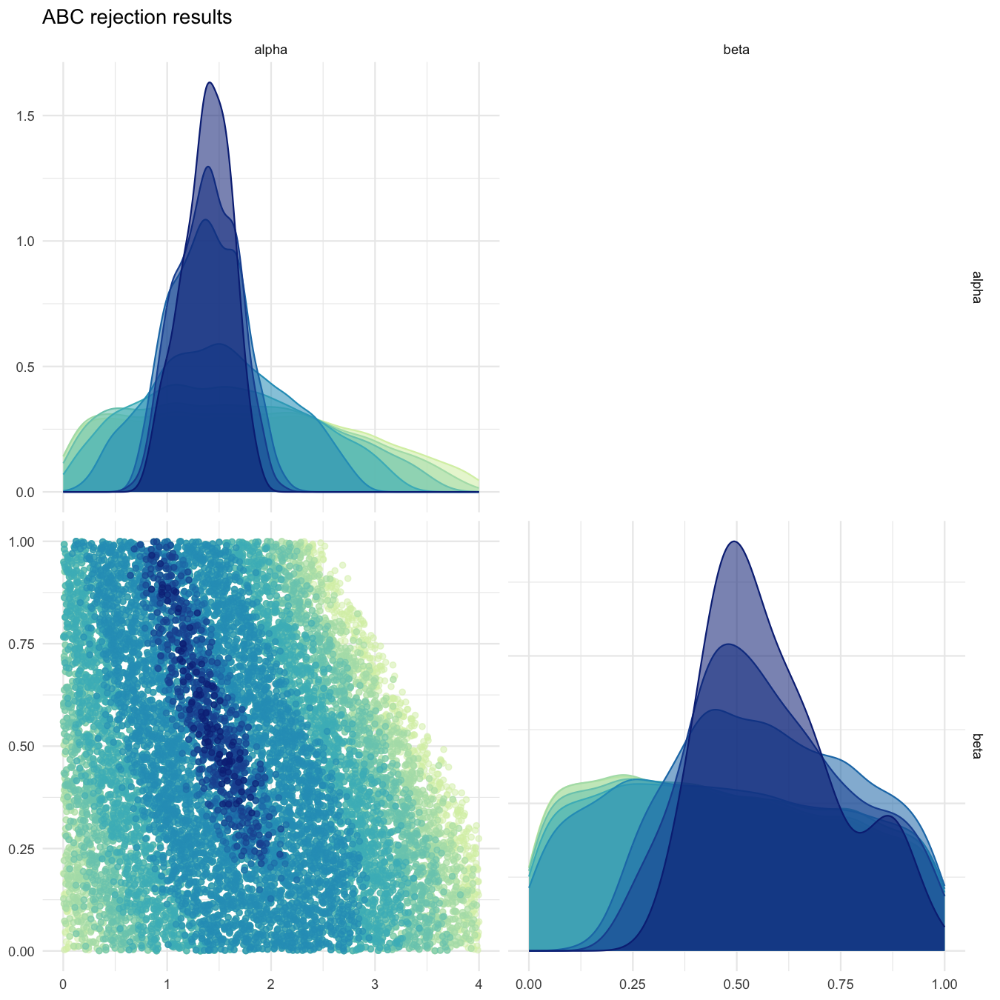

```{r, include = FALSE}
knitr::opts_chunk$set(
  collapse = TRUE,
  comment = "#>"
)
```

# Simple estimation using ABC-rejection

```{r setup}
library(BRREWABC)
```

## Model definition
```{r}
compute_dist <- function(x, ss_obs) {
  ss_sim <- c(x[["alpha"]] + x[["beta"]] + rnorm(1, 0, 0.1),
              x[["alpha"]] * x[["beta"]] + rnorm(1, 0, 0.1))
  dist <- sum((ss_sim - ss_obs)^2)
  return(c(dist))
}

model_list <- list("m1" = compute_dist)
```

## Define prior distribution
```{r}
prior_dist <- list("m1" = list(c("alpha", "unif", 0, 4),
                               c("beta", "unif", 0, 1)))
```

## Create a reference trajectory
```{r}
sum_stat_obs <- c(2.0, 0.75)
```

## Run abc smc procedure
```{r}
res <- abcrejection(model_list = model_list,
                    prior_dist = prior_dist,
                    ss_obs = sum_stat_obs,
                    nb_acc_prtcl = 1000,
                    thresholds = 0.1,
                    max_attempts = 100000,
                    acceptance_rate_min = 0.01,
                    experiment_folderpath = "smplreject",
                    max_concurrent_jobs = 5,
                    verbose = TRUE)
```

## Plot results
```{r}
all_accepted_particles <- res$acc_particles
all_tested_particles <- res$all_tested_particles
plot_abcrejection_res(all_accepted_particles, prior_dist,
                      filename="smplreject/res/figs/smplreject_pairplot.png",
                      colorpal = "YlGnBu")
plot_abcrejection_res(all_tested_particles, prior_dist,
                      thresholds=c(5.0, 4.0, 3.0, 2.0, 1.0, 0.1, 0.05, 0.01),
                      filename="smplreject/res/figs/smplreject_pairplot_custom_thresholds.png",
                      colorpal = "YlGnBu")
```

```{r pairplot, echo=FALSE, fig.cap="Pairplot of accepted particles for the predefined threshold", out.width = '100%'}

```

```{r pairplot_custom, echo=FALSE, fig.cap="Pairplot of accepted particles for different acceptance thresholds", out.width = '100%'}

```
