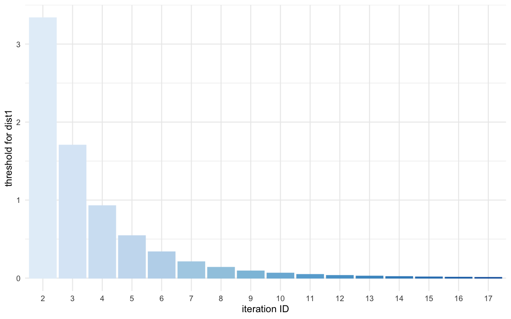
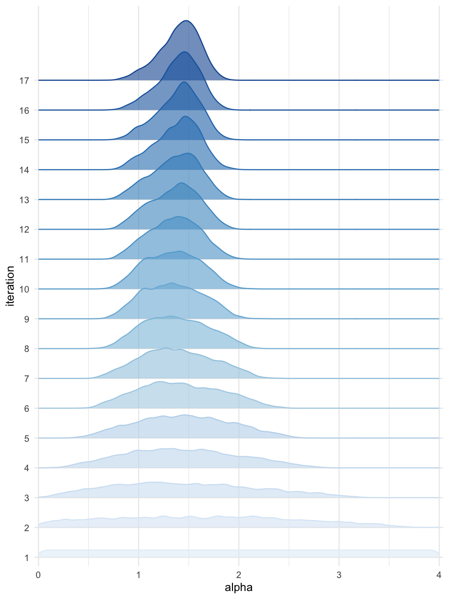
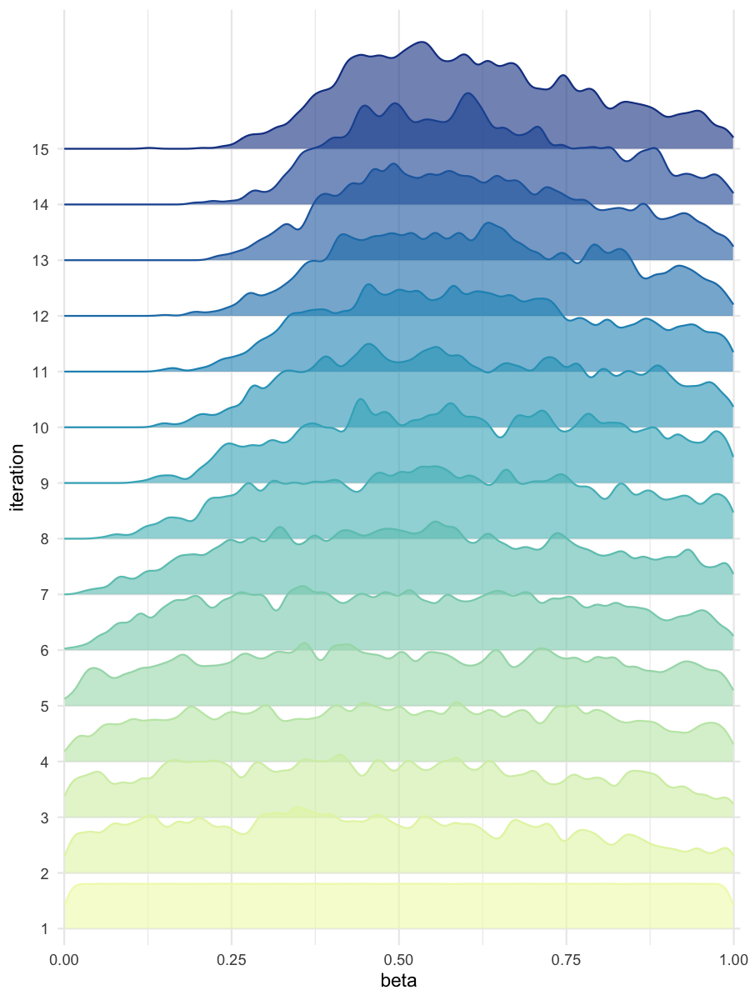

```{r, include = FALSE}
knitr::opts_chunk$set(
  collapse = TRUE,
  comment = "#>"
)
```

To run the ABC-SMC procedure on a cluster, the package has to be installed on the cluster first, and you need two files : (1) a R script containing the code use to run the inference, and (2) a bash script use to launch the master job on the cluster.

(1) `abc-smc_on_sge_cluster.R` :

```{r, eval=FALSE}
library(BRREWABC)

# Model definition
compute_dist <- function(x, ss_obs) {
  ss_sim <- c(x[["alpha"]] + x[["beta"]] + rnorm(1, 0, 0.1),
              x[["alpha"]] * x[["beta"]] + rnorm(1, 0, 0.1))
  dist <- sum((ss_sim - ss_obs)^2)
  return(c(dist))
}

model_list <- list("m1" = compute_dist)

# Define prior distribution
prior_dist <- list("m1" = list(c("alpha", "unif", 0, 4),
                               c("beta", "unif", 0, 1)))

# Create a reference trajectory
sum_stat_obs <- c(2.0, 0.75)

# Run abc smc procedure
res <- abcsmc(model_list = model_list,
              prior_dist = prior_dist,
              ss_obs = sum_stat_obs,
              max_number_of_gen = 30,
              nb_acc_prtcl_per_gen = 5000,
              new_threshold_quantile = 0.75,
              experiment_folderpath = "smploncluster",
              max_concurrent_jobs = 100,
              verbose = TRUE,
              on_cluster = TRUE,
              cluster_type = "sge")

# Plot results
all_accepted_particles <- res$particles
all_thresholds <- res$thresholds
plot_abcsmc_res(data = all_accepted_particles, prior = prior_dist,
                filename = "smploncluster/res/figs/smploncluster_pairplot_all.png", colorpal = "Blues")
plot_densityridges(data = all_accepted_particles, prior = prior_dist,
                   filename = "smploncluster/res/figs/smploncluster_densityridges.png", colorpal = "Blues")
plot_thresholds(data = all_thresholds, nb_threshold = 1,
                filename = "smploncluster/res/figs/smploncluster_thresholds.png", colorpal = "Blues")
```

(2) `launch_abc-smc_on_sge_cluster.sh` :

```{bash, eval=FALSE}
#!/bin/bash
#$ -S /bin/bash
#$ -N abcsmc_prlll
#$ -q "long.q"
#$ -cwd
#$ -V

Rscript abc-smc_on_sge_cluster.R
```

Then launch the master job on the sge cluster with a qsub : `qsub launch_abc-smc_on_sge_cluster.sh`.


```{r pairplot, echo=FALSE, fig.cap="Pairplot of all iterations", out.width = '100%'}
knitr::include_graphics("../man/figures/smploncluster_pairplot_all_m1.png")
```

```{r thresholds, echo=FALSE, fig.cap="Threshold evolution over iterations", out.width = '100%'}

```

```{r densityridges_alpha, echo=FALSE, fig.cap="Density estimates for alpha", out.width = '100%'}

```

```{r densityridges_beta, echo=FALSE, fig.cap="Density estimates for beta", out.width = '100%'}

```
