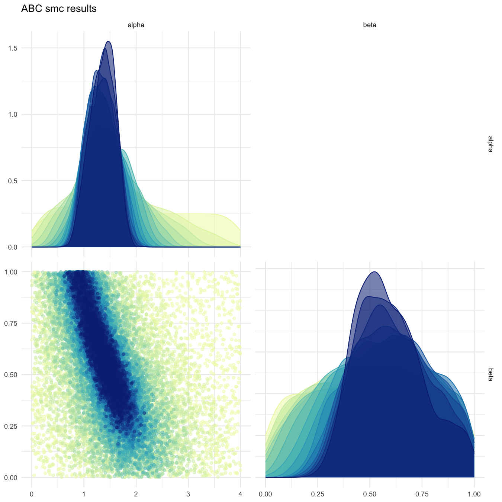
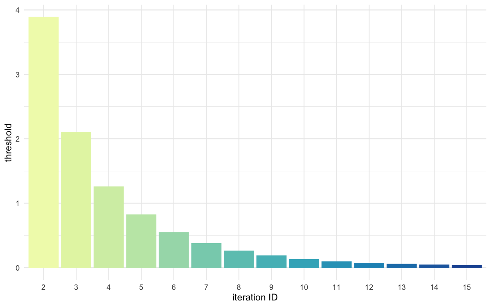
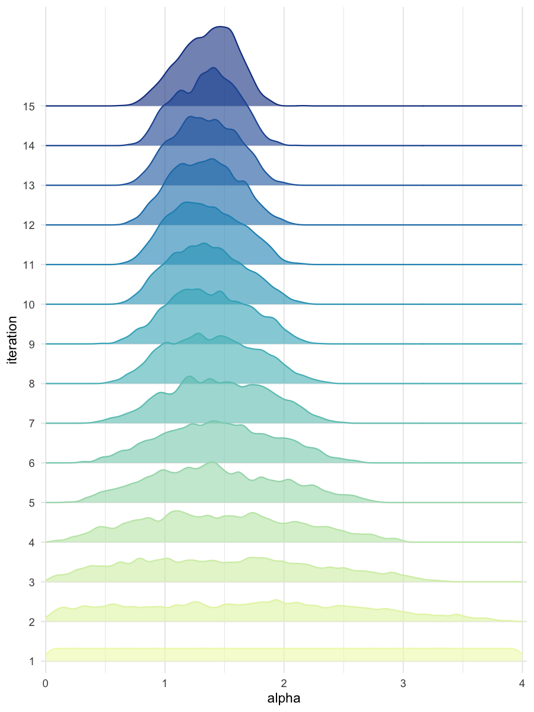
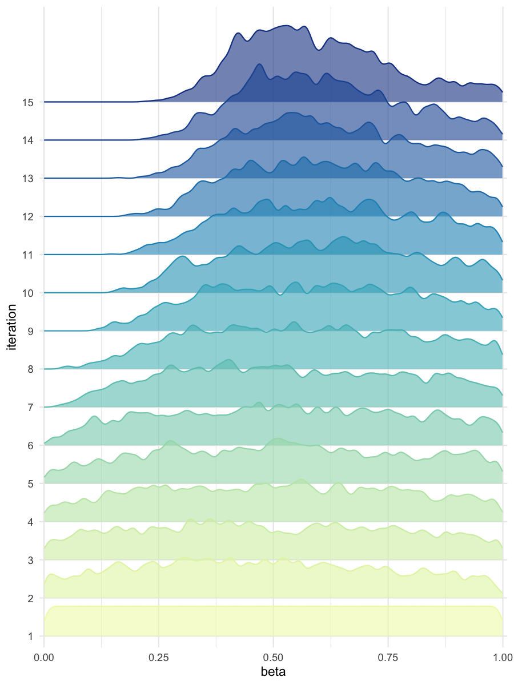

```{r, include = FALSE}
knitr::opts_chunk$set(
  collapse = TRUE,
  comment = "#>"
)
```

## In this example, the model is defined in a separate R file 'model.R':

```{r model, eval=FALSE}
toy_model <- function(x) {
  c(x[["alpha"]] + x[["beta"]] + rnorm(1, 0, 0.1),
    x[["alpha"]] * x[["beta"]] + rnorm(1, 0, 0.1))
}
```

After that, the procedure is pretty much the same:

```{r setup, eval=FALSE}
library(BRREWABC)
source("model.R")
```

## Model definition
```{r, eval=FALSE}
compute_dist <- function(x, ss_obs) {
  ss_sim <- toy_model(x)
  dist <- sum((ss_sim - ss_obs)^2)
  return(c(dist))
}

model_list <- list("m1" = compute_dist)
```

## Define prior distribution
```{r, eval=FALSE}
prior_dist <- list("m1" = list(c("alpha", "unif", 0, 4),
                               c("beta", "unif", 0, 1)))
```

## Create a reference trajectory
```{r, eval=FALSE}
sum_stat_obs <- c(2.0, 0.75)
```

## Run abc smc procedure
```{r, eval=FALSE}
res <- abcsmc(model_list = model_list,
              model_def = "model.R",
              prior_dist = prior_dist,
              ss_obs = sum_stat_obs,
              max_number_of_gen = 15,
              nb_acc_prtcl_per_gen = 2000,
              new_threshold_quantile = 0.8,
              experiment_folderpath = "smpl",
              max_concurrent_jobs = 5,
              verbose = FALSE)
```

## Plot results
```{r, eval=FALSE}
all_accepted_particles <- res$particles
all_thresholds <- res$thresholds
plot_abcsmc_res(data = all_accepted_particles, prior = prior_dist,
                filename = "smpl/res/figs/smpl_pairplot_all.png", colorpal = "YlGnBu")
plot_densityridges(data = all_accepted_particles, prior = prior_dist,
                   filename = "smpl/res/figs/smpl_densityridges.png", colorpal = "YlGnBu")
plot_thresholds(data = all_thresholds, nb_threshold = 1,
                filename = "smpl/res/figs/smpl_thresholds.png", colorpal = "YlGnBu")
```

```{r pairplot, echo=FALSE, fig.cap="Pairplot of all iterations", out.width = '100%'}

```

```{r thresholds, echo=FALSE, fig.cap="Threshold evolution over iterations", out.width = '100%'}

```

```{r densityridges_alpha, echo=FALSE, fig.cap="Density estimates for alpha", out.width = '100%'}

```

```{r densityridges_beta, echo=FALSE, fig.cap="Density estimates for beta", out.width = '100%'}

```
